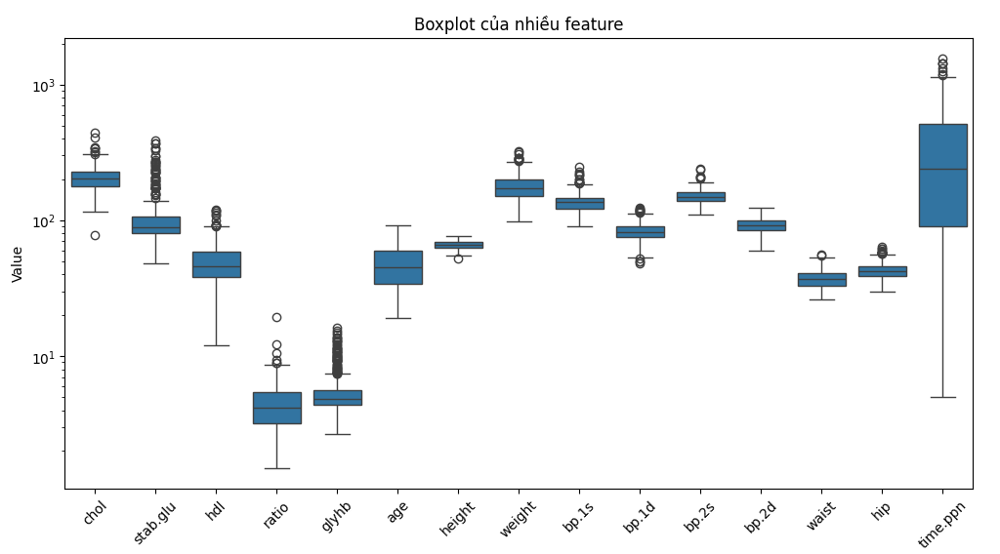

# Diabetes-forecasting-and-analysis

## Introduction
In the recent times, the prevalence of people with diabetes is proliferating, which has posed a formidable challenge to the global healthcare system. To remedy this situation, innovative approaches are necessary to improve the capability of prediction and management this kind of disease. Thus, in this project, I would like to build a Machine Learning model to forecast diabetes, as well as analyze in depth how factors affect the likelihood of development of disease, so that the doctors can take timely and appropriate measures to prevent and treat the disease effectively.

## Data source
The dataset I use derives from Kaggle (https://www.kaggle.com/datasets/imtkaggleteam/diabetes/data)

## Data overview
The dataset contains the raw data of several hundred rural African-American. This data includes 403 samples and 18 features. Specifically as follows:
  - chol: Total Cholesterol
  - stab.glu: Stabilized Glucose
  - hdl: High Density Lipoprotein Cholesterol
  - ratio: Ratio between Total Cholesterol and HDL (chol/hdl)
  - Age and gender
  - Height and weight
  - Frame: Body Frame Size (Large, Medium, Small)
  - bp.1s: First systolic blood pressure
  - bp.1d: First diastolic blood pressure
  - waist
  - hip: Hybrid Insulin Peptides
  - time.ppn: Partial parenteral nutrition
  - glyhb: Glycosylated Hemoglobin (HBA1C)
## Tools and techniques applied
### 1. Tools
- Google Colabs: using Python to load data, clean data, build Machine Learning models and do feature analysis.
- Power Bi: visualizing the dataset.
### 2. Techniques
In this project, I will use two Machine Learning models: **Random Forest and XGBoost**, to forecast diabetes. Besides, this is a medical dataset, there is an imbalance between classes in target variable, which could lead to classification bias towards the majority class. Thus, I will use **oversampling technique** to solve this problem.
And finally, to do feature analysis, I will choose **SHAPLEY** to see how features affect the outcome.
## Methodology
Here is a pipeline of my work:
||
|:--:|
|**Fig.1. Pipeline of my work**|
### 1. Load data
Firsly, I download the dataset from Kaggle on the above link. Then, I will import it into Google Colabs by the code:
```python
df = pd.read_csv('diabetes.csv')
```
And here is an overview of the dataset:
||
|:--:|
|**Fig.2. First 5 rows of the dataset**|

### 2. EDA
Now, let's take a look at some descriptive information of this dataset:
```python
df.describe()
```
||
|:--:|
|**Fig.3. Statistical information of numeric features in the dataset**|

From this table, I can draw some information:
  - Missing data appears in many columns, for example: **chol**, **hdl**, **stab.glu**, **glyhb**, etc. A summary table of the number of missing values in all columns is necessary.
  - In terms of the distribution of features:
      - Some features have a large range between min and max, for example, the **stab.glu** (Stabilized Glucose) column has a value range from *48* to *385*, **weight** from *99* to *325* (in lbs), etc. This shows the presence of outliers, more visual images are needed to check.
      - The **chol** (Cholesterol) column has an average of about *207.85*, with a standard deviation of *44.44*, showing that the data has a quite large dispersion.
      - The **glyhb** (HBA1C) column has an average value of *5.59*, but the max is up to *16.11*, which may suggest a group of patients with high blood sugar or diabetes.
        
Here is the number of missing values in all columns:

||
|:--:|
|**Fig.4. Number of missing values in all columns**|

Next, let's see the histogram of the dataset to have a clear view of dataset's distribution:
```python
df.hist(figsize=(12, 10), bins=30)
plt.show()
```
||
|:--:|
|**Fig.5. Histogram of all numeric features**|

Then, the boxplots to check the presence of outliers:
```python
numeric_col = df.select_dtypes('number').columns.to_list()
numeric_col.remove('id')
df_melted = df[numeric_col].melt(var_name = 'Feature', value_name = 'Value')

plt.figure(figsize=(12, 6))
sns.boxplot(x="Feature", y="Value", data=df_melted)
plt.xticks(rotation=45)  # Rotate the label name 
plt.yscale('log') # Using log scale to see the boxplots of features with small range better
plt.title("Boxplot của nhiều feature")
plt.show()
```
||
|:--:|
|**Fig.6. Boxplots of all numeric features**|

In summary, I must solve the problem of missing values first, then based on the situation of the dataset after cleaning, I will consider whether to handle the outliers or not. Thus, from doing EDA on the dataset, I can have an overview of the dataset to make a plane for the next step, data cleaning. 
### 3. Data cleaning
From the **Fig.4** above, we can see that there are so many missing values in two columns **bp.2s** and **bp.2d**, both are *262*. Thus, my solution for this is remove them from the dataset:
```python
df.drop(['bp.2s','bp.2d'], axis=1, inplace=True)
```
Next, for the remaining numeric features, I will fill NA with the mean value of each column:
```python
numeric_col_na = ['chol','hdl','ratio','glyhb','height','weight','bp.1s','bp.1d','waist','hip','time.ppn']
def fill_missing_value_numeric(col_name):
  for col in col_name:
    df[col] = df[col].fillna(df[col].mean().round( ))
  return df
fill_missing_value_numeric(numeric_col_na)
```
||
|:--:|
|**Fig.7. The result after cleaning**|

Only the feature **frame** left has *12* NA values. Since this is a categorical variable, I will fill the NA with the mode value of the column.
```python
df['frame'] = df['frame'].fillna(df['frame'].mode()[0])
```
After having a data file that no longer has any NA values, I will export this file to Excel format to use for visualization steps on Power Bi:
```python
df.to_excel('cleaned_data.xlsx', index=False)
from google.colab import files # Load this package to download the cleaning file
files.download('cleaned_data.xlsx')
```
Next, I will add a **BMI** column from the 2 features **height** (in inch) and **weight** (in lbs) with the aim of helping the model learn the relationship between features better. To do this, I need to change the units first: 1 kg = 0.4536 lbs and 1 inch = 0.0254 m
||
|:--:|
|**Fig.8. BMI formula**|

```python
# Add BMI column from weight and height
df['BMI'] = (((df['weight']) * 0.4536) / ((df['height'] * 0.0254)**2)).round(1)
```
Then, to bring the problem to a 2-class classification, I will add an **outcome** column calculated based on the **glyhb** feature with the condition that if **glyhb** is greater than or equal to *6.5*, it will be 1 (Diabetes), otherwise it will be 0 (Normal). This will be the target variable of the dataset.
```python
# Add outcome column from glyhb, 0 for Normal and 1 for Diabetes
df['outcome'] = np.where(df['glyhb'] >= 6.5, 1, 0)
```
||
|:--:|
|**Fig.9. Two new columns are added to the dataset**|

### 4. EDA after cleaning
To facilitate the model building later, I will conduct the final EDA test. First, I will check the correlation between the features and the target variable. Because the target variable is binary and the features also have 2 data types: continuous and categorical. So I will divide into 2 groups to check the correlation. Group 1 will use the **Point Biserial** method to check the correlation between the continuous variable features and the target.
```python
# Check correlation
# Continous numeric feature
continuous_numeric = ['chol','stab.glu','hdl','ratio','glyhb','age','height','weight','bp.1s','bp.1d','waist','hip','time.ppn','BMI']

from scipy.stats import pointbiserialr

for col in continuous_numeric:
    corr, p_value = pointbiserialr(df[col], df['outcome'])
    print(f"Correlation between {col} and Outcome: {corr:.4f}, p-value: {p_value:.4f}")
```
The second group will consist of categorical features, I will use **Chi-square** test to check the correlation between them and the target variable:
```python
# Categorical numeric feature
categorical_numeric = ['location','gender','frame']

from scipy.stats import chi2_contingency

for col in categorical_numeric:
    contingency_table = pd.crosstab(df[col], df['outcome'])
    chi2, p_value, _, _ = chi2_contingency(contingency_table)
    print(f"Chi-square test between {col} and Outcome: p-value = {p_value:.4f}")
```
And here is the result:
|||
|:--:|:--:|
|**Fig.10. The correlation between continous features and target variable**|**Fig.11. The correlation between categorical features and target variable**|

After performing EDA before conducting data preprocessing for model training, I have some preliminary assessments as follows:
  - Initial correlation analysis: I tested the correlation between features and target variables using **Point-Biserial** and **Chi-square** to determine which features are likely to affect the outcome. However, it should be noted that these tests only reflect the linear relationship between each feature and the target independently. Therefore, a feature with a p-value greater than 0.05 does not mean that it has no influence on the model, but the relationship between that feature and the outcome may be nonlinear or only clearly shown when considered together with other features. Correlation testing only provides a preliminary view of the data, helping to detect features that are likely to have a strong impact. However, to make a more comprehensive assessment of the importance of features in the model, it is necessary to use more comprehensive evaluation methods instead of just considering the independent relationship between each feature and the target.
    
  - Outlier handling: Based on the data distribution and the proportion of classes in the target variable, I found that the dataset has a large imbalance (Fig. 12). Careless handling of outliers can lose important information, especially in a dataset with a limited number of samples. Therefore, I decided not to handle outliers and instead use tree-based models such as **Random Forest** or **XGBoost** to reduce the impact of outliers on the prediction results.

||
|:--:|
|**Fig.12. The pie chart showing the imbalance between Normal and Diabetes classes**|

### 5. Data preprocessing
First, I must encode the object data types (**location**, **gender**, **frame**) into binary form using one hot encoding technique.
```python
object_col = ['location','gender','frame']
df_encoded = pd.get_dummies(df, columns= object_col, dtype = 'int', drop_first= True)
df_encoded.drop('id', axis=1, inplace=True)

# Move the target variable to the last position of the dataframe
a = df_encoded['outcome']
df_encoded.drop('outcome', axis=1, inplace = True)
df_final = pd.concat([df_encoded, a], axis=1)
```
||
|:--:|
|**Fig.13. The dataset after using one-hot encoding technique**|

Next, I need to remove the column **glyhb** from the dataset before building the model. Because the target variable is directly created from this column, so if we keep it in the model, which can make the model biased toward this relationship and ignore the others.
```python
df_final.drop('glyhb', axis=1, inplace=True)
```
Now we have 403 samples and 18 columns in total.

### 6. Building Machine Learing models
Firstly, I will load the libraries that need for building models:
```python
from sklearn.model_selection import train_test_split
from sklearn.ensemble import RandomForestClassifier
from xgboost import XGBClassifier
from sklearn.metrics import classification_report
from sklearn.metrics import accuracy_score
from sklearn.metrics import confusion_matrix
```
As I mentioned above, because there is a huge imbalance between the 2 classes Normal and Diabetes, I will proceed to build a prediction model for both cases, that is, without and with handling imbalance, to compare the performance. During the entire process, I will use two models: **Random Forest** and **XGBoost** to forecast and then compare which one is better.
#### 1. Without handling imbalnce
```python
df_original = df_final.copy() # Make a copy to avoid disturbing the original dataset

X = df_original.drop('outcome', axis=1)
y = df_original['outcome']

X_train, X_test, y_train, y_test = train_test_split(X,y, test_size = 0.3, random_state=42)

# Using Random Forest to forecast
model_1 = RandomForestClassifier(n_jobs= -1, random_state=42)
model_1.fit(X_train, y_train)
Y_prob_1 = model_1.predict_proba(X_test)[:,1]
threshold = 0.3 # Set the threshold 0.3 to enhace the Recall
Y_pred_1 = (Y_prob_1 >= threshold).astype(int)
print(classification_report(y_test, Y_pred_1, target_names=['Normal', 'Diabetes']))
```
```python
model_2 = XGBClassifier()
model_2.fit(X_train, y_train)
Y_prob_2 = model_2.predict_proba(X_test)[:,1]
threshold = 0.45
Y_pred_2 = (Y_prob_2 >= threshold).astype(int)
print(classification_report(y_test, Y_pred_2, target_names=['Normal', 'Diabetes']))
```
|||
|:--:|:--:|
| **Fig.14. Classification report of the Random Forest for the first case**| **Fig.15. Classification report of the XGBoost for the first case**|

And here are confusion matrices of the two models
|||
|:--:|:--:|
| **Fig.16. Confusion matrix of the Random Forest for the first case**| **Fig.17. Confusion matrix of the XGBoost for the first case**|

We can see that, although the **Accuracy** metric is very high for both models (*90%*), it is because this metric has been fooled when encountering a serious imbalance between classes, so we cannot use this metric to evaluate in this circumstance. Therefore, if the imbalance between classes in the dataset is not handled, the model will give very bad performance in terms of the ability to recognize people with real diseases (low **Recall**). This is extremely dangerous if the model is applied in practice because it will miss people with real diseases. So, let's move to the second case where I solve the imbalance by oversampling technique.

#### 2. Handling imbalance
I will use an oversampling technique called **Borderline SMOTE**, which is capable of generating synthetic samples for minority classes located near the classification border between the two classes, thereby helping to balance the number of samples between the two sides.
```python
# Make a copy from original dataset
df_oversampling = df_final.copy()

X = df_oversampling.drop('outcome', axis=1)
y = df_oversampling['outcome']

X_train, X_test, y_train, y_test = train_test_split(X,y, test_size = 0.3, random_state=42)

# Import the package to use Borderline SMOTE
from imblearn.over_sampling import BorderlineSMOTE
# Use SMOTE Borderline to solve imbalance between classes
smote_border = BorderlineSMOTE(kind = "borderline-1", random_state=42)
X_train_smote_border, y_train_smote_border = smote_border.fit_resample(X_train,y_train)

# Using Random Forest
model_3 = RandomForestClassifier(n_jobs= -1, random_state=42)
model_3.fit(X_train_smote_border, y_train_smote_border)
Y_prob_3 = model_3.predict_proba(X_test)[:,1]
threshold = 0.5
Y_pred_3 = (Y_prob_3 >= threshold).astype(int)
print(classification_report(y_test, Y_pred_3, target_names=['Normal', 'Diabetes']))
```
```python
# Using XGBoost
model_4 = XGBClassifier()
model_4.fit(X_train_smote_border, y_train_smote_border)
Y_prob_4 = model_4.predict_proba(X_test)[:,1]
threshold = 0.4
Y_pred_4 = (Y_prob_4 >= threshold).astype(int)
print(classification_report(y_test, Y_pred_4, target_names=['Normal', 'Diabetes']))
```
|||
|:--:|:--:|
| **Fig.18. Classification report of the Random Forest for the second case**| **Fig.19. Classification report of the XGBoost for the second case**|

|||
|:--:|:--:|
| **Fig.20. Confusion matrix of the Random Forest for the second case**| **Fig.21. Confusion matrix of the XGBoost for the second case**|

From the above results, we can see the effectiveness of using oversampling for severely imbalanced data problems, which is to significantly improve the prediction performance for the minority class. Because the purpose of this project will be to predict diabetics, improving the **Recall** for this class, as well as being able to balance the **Precision** metric, is very important. And the results show that both models have done this well, with the **Precision**, **F1-score** and especially **Recall** all significantly improved compared to when not handling imbalance.

### 7. Feature analysis
To analyze feature importance, I will use the **SHAP** method. This is a method that helps explain the impact of each feature on the prediction results of a Machine Learning model, showing which features have a positive or negative influence on the output results. This method can overcome the weaknesses of correlation tests such as Point-Biserial and Chi-square, which only measure the relationship between each feature and the target independently, and assume a linear relationship between variables. This may miss nonlinear interactions or indirect effects between features. In contrast, **SHAP** allows assessing the impact of each feature in the context of the entire model, providing a more comprehensive and comprehensive view of the importance of features. And to use SHAP, first, I will have to install the **SHAP** library first and then import the **Shap** package.
```python
! pip install shap

import shap
```
```python
explainer = shap.Explainer(model_4, X_train_smote_border) # Create a variable Explainer
shap_values = explainer(X_test) # Use this variable to explain the result on X test to find shap values for each feature
```
|||
|:--:|:--:|
|**Fig.22. The plot showing the mean SHAP value of each feature**|**Fig.23. The plot showing how each feature affects the predicting result of the model**|

Let me explain a little about these two special graphs. First is the plot on the left, this plot will show us which features have the biggest impact on the model's prediction results through the mean SHAP value. We can see that the **stab.glu** (Stabilized Glucose) feature has the biggest impact, followed by **age**, **chol** (Cholesterol), **gender_male**, etc. 

In the remaining plot, it will show us how these features affect the output of the model. Specifically, red dots represent high values ​​of the feature, conversely, blue dots represent low values. For example, the feature **stab.glu**, we see that on the right side of the plot, there are many red dots, which means that when the value of this feature increases or can be understood as when the amount of Glucose increases, the prediction result of the model will tend towards the result of 1 (ie having Diabetes). On the left side, there are many blue dots, showing that when the amount of blood sugar decreases, the possibility of getting the disease also decreases. Applying this explanation to the remaining features, we will see the trend of these features affecting the output of the model. 

To reinforce my analysis, I used Power Bi for visualization and the detailed results of those analyses I have explained in the **Graduation_project.pptx** file, attached with this read.me file. I have done feature importance analysis for the top 6 features that have strong impact on the model output in this Power Point file. You can check it out.

### 8. Conclusion
After analyzing the features, I have some conclusions as follows:
  - Glucose and HBA1c are 2 important indicators for diagnosing diabetes. 
  - Other indicators such as Cholesterol, HDl, blood pressure, etc., are closely related to the above 2 indicators. They can act as warning indicators of the sequelae of the disease. Because diabetic patients often die from complications such as atherosclerosis, cardiovascular disease, kidney failure, pancreatic failure, infection, etc., more than actually dying from this disease.

And here are some of my suggestions from the above results:
  - Patients need to maintain these indicators at the allowable threshold to avoid danger.
  - Apply healthy lifestyles for better prevention and treatment, especially in the elderly.

